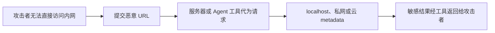

# 服务端请求伪造(SSRF)

## 中文速读

📌 **是什么**：SSRF（Server-Side Request Forgery，服务端请求伪造）是攻击者诱导服务器替自己发出网络请求。

🎯 **攻击目标**：攻击者自己通常访问不了目标地址，但服务器可能拥有访问 `localhost`、公司内网、私网服务或云 metadata 的权限，于是攻击者借用了服务器的网络身份和权限。

➕ **举个例子**：一个 Agent 的 API 工具接受任意 URL，并直接执行 `requests.get(url)`。攻击者把 URL 指向 `127.0.0.1/admin`，就可能让 Agent 所在服务器替他访问内部管理页面。

> 最重要的一句话：SSRF 的危险不是攻击者自己访问了内网，而是他让服务器替自己访问了内网。

## 核心因果链



它叫 **Server-Side**，是因为真正发出危险请求的是服务器，而不是攻击者的浏览器。

## Agent 工具中的两个典型绕过

### 1. `@` 伪装允许域名

```text
https://api.github.com@169.254.169.254/latest/meta-data
```

这段 URL 看起来包含 `api.github.com`，但 `@` 前面的部分可能被解释为 userinfo，真正的 hostname 是 `169.254.169.254`。它是常见的云 metadata 地址，可能暴露临时凭证等敏感信息。

因此不能用字符串前缀判断：

```python
if url.startswith("https://api.github.com"):
    requests.get(url)  # 不安全
```

应先解析 URL，再精确检查 `scheme`、`hostname` 和 `port`。

### 2. 允许域名重定向到内网

```text
https://允许域名.example/redirect
    -> 302 Location: http://127.0.0.1/admin
```

如果客户端只校验第一个 URL，然后自动跟随 302，第二跳的真实目标就绕过了初始校验。可以直接禁止自动重定向；如果业务必须支持重定向，就要限制跳转次数，并对每一跳的 `Location` 重新执行完整安全校验。

## 可能造成什么后果

- 访问 `localhost` 或公司内网管理接口；
- 读取云 metadata 和临时凭证；
- 探测内部主机与端口；
- 调用只信任内网来源的服务；
- 把内部响应通过工具结果、日志或模型回答泄露给攻击者。

常见风险入口包括 URL 预览、图片抓取、Webhook 测试、网页爬取、RAG 网页导入、反向代理，以及允许模型生成 URL 的 Agent API 工具。

## 防护原则

按“越靠前越好”的顺序处理：

1. 优先使用固定 endpoint，不让用户或模型提供任意 URL。
2. 必须动态访问时，只允许精确的 `https + hostname + port` allowlist。
3. 拒绝 loopback、私网、link-local、云 metadata 和不允许的显式端口。
4. 禁止自动重定向，或逐跳重新校验 `Location`。
5. 解析 DNS 后再次检查目标 IP；防范 DNS rebinding 和连接阶段目标漂移。
6. 使用网络出口策略限制服务器真正能够访问的目标。
7. 设置 timeout、响应大小上限和稳定错误返回，缩小故障与泄露范围。

> `urlparse()` 只是宽松解析器，不是完整的安全校验器；allowlist 也不应只靠字符串包含或前缀判断。

## T3-Gate 当前做到哪里

当前三工具助手已经实现了最小安全边界：

- 强制 HTTPS；
- 精确 hostname allowlist；
- 只允许未显式写端口或 `443`；
- 拒绝伪装 hostname、localhost、私网和 metadata 目标；
- 使用 `allow_redirects=False`，不跟随 3xx；
- 通过 mock 复现恶意 URL、危险重定向和 timeout，并验证稳定拒绝。

仍需注意：仅检查 URL 字符串和解析出的 hostname 不能覆盖全部 DNS rebinding、解析后 IP 变化与网络出口策略问题，这些属于后续生产安全加固范围。

## 错误理解 → 正确理解

- **错误**：URL 里出现允许域名就安全。  
  **正确**：必须检查解析后的真实 hostname；`@` 前面的文本可能不是 hostname。
- **错误**：第一次 URL 通过白名单，后续请求就一定安全。  
  **正确**：重定向会改变真实目标；每一跳都要重新校验，或直接禁止跳转。
- **错误**：SSRF 是攻击者自己访问内网。  
  **正确**：攻击者借用服务器的网络权限，让服务器代为访问。
- **错误**：客户端拒绝危险调用后，不需要告诉模型。  
  **正确**：在 Tool Calling 协议中，拒绝结果仍应按原 `tool_call_id` 回填为 `role="tool"` 错误消息。

## 复习检查

遇到一个会访问 URL 的服务或 Agent 工具时，依次问：

1. 谁能控制 URL？
2. 解析后的真实 scheme、hostname、port 是什么？
3. DNS 最终解析到了什么 IP？
4. 是否会跟随重定向，每一跳是否重新校验？
5. 即使应用层漏检，网络出口是否仍能阻止访问内网？

## 相关

- [[02-Concepts/Agent/外部 API 工具(External API Tool)|外部 API 工具]]
- [[HTTP 请求全链路与错误处理]]
- [[02-Concepts/Agent/工具定义与执行协议(Tool Definition)|工具定义与执行协议]]
- [[04-Projects/Agent/AI-Agent-Learning/t3-gate-tool-assistant|T3-Gate 三工具助手]]
- [[07-Reviews/AI-Agent-Learning/2026-07-12-t3-gate-tool-calling-review|T3-Gate PASS 复盘]]
